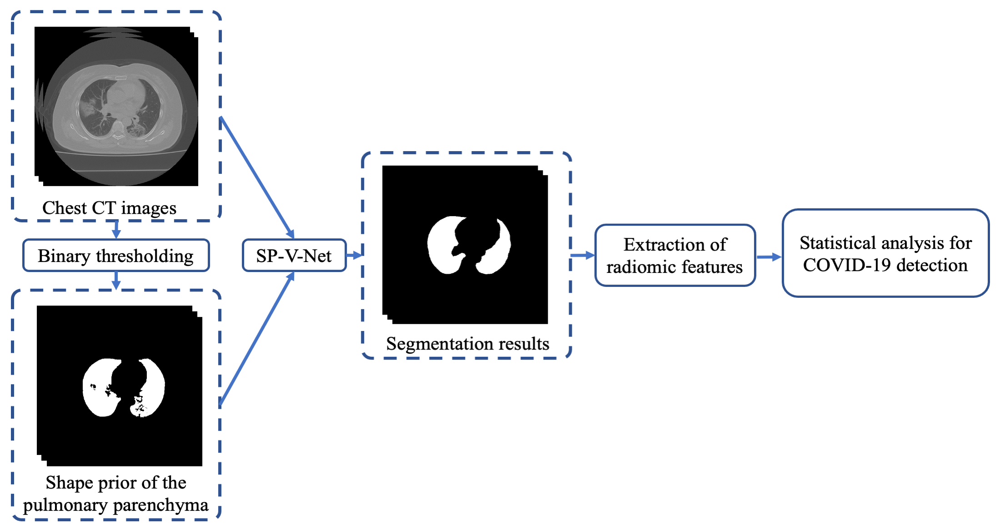
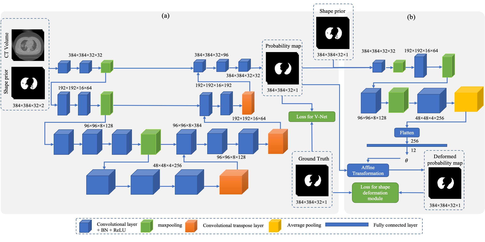

# Code for "Lung segmentation and automatic detection of COVID-19 using radiomic features from chest CT images"

** This paper has been published in Pattern Recognition: https://doi.org/10.1016/j.patcog.2021.108071
Please read the paper for more details.

This paper aims to develop an automatic method to segment pulmonary parenchyma in chest CT images and analyze texture features from the segmented pulmonary parenchyma regions to assist radiologists for COVID-19 diagnosis. A new segmentation method, which integrates a 3D V-Net with a shape deformation module implemented using a spatial transform network (STN), was proposed to segment pulmonary parenchyma in chest CT images. The 3D V-Net was used to perform end-to-end lung extraction while the deformation module was utilized to restrict the V-Net output according to the prior shape knowledge. The proposed segmentation method was validated against the annotation obtained by experienced operators using both Dice similarity and radiomic features. These features from our segmentation results were further analyzed by sophisticated statistical analyses with high interpretability to discover significant independent predictors and build prediction models for the classification of lung infection by COVID-19. Experimental results demonstrate that compared with the manual annotation, the proposed segmentation method achieved a Dice similarity coefficient of 0.9796, a sensitivity of 0.9840, a specificity of 0.9954 and a mean surface distance error of 0.0318 mm in the pulmonary parenchyma segmentation task. Furthermore, our COVID-19 classification model achieved an area under curve (AUC) of 0.99, a sensitivity of 0.95, and a specificity of 0.98 when discriminating lung infection with COVID-19 from community-acquired pneumonia and normal controls using the statistically significant predictors. The significant radiomic predictors extracted from our segmentation results agree well with those from the manual annotation. Our approach has a great promise for clinical use in facilitating automatic diagnosis of COVID-19 infection on chest CT images.

Figure 1. Workflow of the proposed approach for lung segmentation and COVID-19 detection. A thresholding method was applied to generate the shape prior of the pulmonary parenchyma; the combination of the original image and shaper prior was input to the proposed shape prior V-Net segmentation model (SP-V-Net). Statistical analyses were applied to the radiomic features extracted from our segmentation results to discover the statistically significant predictors and build the prediction model for COVID-19 detection. 



Figure 2. The architecture of the proposed SP-V-Net for pulmonary parenchyma segmentation. (a) An end-to-end 3D V-Net for lung segmentation. (b) The shape prior deformation module which is based on a spatial transformation network (STN).



### Note
The code was developed based on Tensorflow 1.14 and trained on a NVIDIA Titan V. The model required about 10 GB GPU memory and at least 16 GB RAM.


### 1. Architecture of the data dolder
- data
     - binary/subject/label/*.png: png images are binary labels for lung ROIs.
     - image/subject/*.dcm : all dicom slices are stored in a separate folder.
     - numpy:processed numpy arrays for original inputs, binary labels, and shape prior.
     - classification.csv: see example. 0 for healthy subject, 1 for normal pneumonia, 2 for COVID-19 subject.

command to generate the shape priors for each subjects:

```
python3 generate_data_and_shape_prior.py \
  --dicom_path=/media/zhaochen/data/covid_seg/data/data_sh_covid/images\
  --label_path=/media/zhaochen/data/covid_seg/data/data_sh_covid/binary \
  --visualize_path=/media/zhaochen/data/covid_seg/data/data_sh_covid/visualize \
  --numpy_path=/media/zhaochen/data/covid_seg/data/data_sh_covid/numpy \
  --mode=1
```

### 2. Segmentation model training
Three models were developed in this paper. commands for training:
```
# Code for training SP-V-Net
python3 train_seg_reg.py --exp=exp/seg_reg_cv_0 \
  --data_path=/media/zhaochen/data/covid_seg/data/data_sh_all/numpy \
  --csv_path=/media/zhaochen/data/covid_seg/data/data_sh_all/classification.csv \
  --dicom_path=/media/zhaochen/data/covid_seg/data/data_sh_all/images \
  --n_workers=6 \
  --cv=0 \
  --cv_max=5 \
  --train=True \
  --validate_epoch=100 \
  --gpu=0 \
  --dropout_p=0.5

# Code for training MV-V-Net
python3 train_seg_prior.py --exp=exp/seg_prior_cv_0 \
  --data_path=/media/zhaochen/data/covid_seg/data/data_sh_all/numpy \
  --csv_path=/media/zhaochen/data/covid_seg/data/data_sh_all/classification.csv \
  --dicom_path=/media/zhaochen/data/covid_seg/data/data_sh_all/images \
  --n_workers=6 \
  --cv=0 \
  --cv_max=5 \
  --train=True \
  --validate_epoch=100 \
  --gpu=0 \
  --dropout_p=0.5

# Code for training V-Net
python3 train_seg.py --exp=exp/seg_cv_0 \
  --data_path=/media/zhaochen/data/covid_seg/data/data_sh_all/numpy \
  --csv_path=/media/zhaochen/data/covid_seg/data/data_sh_all/classification.csv \
  --dicom_path=/media/zhaochen/data/covid_seg/data/data_sh_all/images \
  --n_workers=6 \
  --cv=0 \
  --cv_max=5 \
  --train=True \
  --validate_epoch=100 \
  --gpu=0 \
  --dropout_p=0.5
```

### 3. Make prediction and generate features
```
# Code for prediction making using V-Net
python3 train_seg.py --exp=exp/seg_cv_0 \
  --data_path=/media/zhaochen/data/covid_seg/data/data_sh_all/numpy \
  --csv_path=/media/zhaochen/data/covid_seg/data/data_sh_all/classification.csv \
  --dicom_path=/media/zhaochen/data/covid_seg/data/data_sh_all/images \
  --n_workers=6 \
  --cv=0 \
  --cv_max=5 \
  --train=False \
  --validate_epoch=100 \
  --gpu=0 \
  --feature_pattern=pred \
  --feature_extract_clf_csv=/media/zhaochen/data/covid_seg/data/data_sh_all/classification_for_prediction.csv \
  --feature_coor_threshold=0.83

# Code for prediction making using MC-V-Net
python3 train_seg_prior.py --exp=exp/seg_prior_cv_0 \
  --data_path=/media/zhaochen/data/covid_seg/data/data_sh_all/numpy \
  --csv_path=/media/zhaochen/data/covid_seg/data/data_sh_all/classification.csv \
  --dicom_path=/media/zhaochen/data/covid_seg/data/data_sh_all/images \
  --n_workers=6 \
  --cv=0 \
  --cv_max=5 \
  --train=False \
  --validate_epoch=100 \
  --gpu=0 \
  --feature_pattern=pred \
  --feature_extract_clf_csv=/media/zhaochen/data/covid_seg/data/data_sh_all/classification_for_prediction.csv \
  --feature_coor_threshold=0.83
  
# Code for prediction making using SP-V-Net
python3 train_seg_reg.py --exp=exp/seg_reg_cv_0 \
  --data_path=/media/zhaochen/data/covid_seg/data/data_sh_all/numpy \
  --csv_path=/media/zhaochen/data/covid_seg/data/data_sh_all/classification.csv \
  --dicom_path=/media/zhaochen/data/covid_seg/data/data_sh_all/images \
  --n_workers=6 \
  --cv=0 \
  --cv_max=5 \
  --train=False \
  --validate_epoch=100 \
  --gpu=0 \
  --feature_pattern=pred \
  --feature_extract_clf_csv=/media/zhaochen/data/covid_seg/data/data_sh_all/classification_for_prediction.csv \
  --feature_coor_threshold=0.83
```

### 4. Statistical analysis for COVID-19 detection
```
# Feature analysis and COVID-19 detection using SP-V-Net
python3 ignore feature_analysis_executor.py --exp=/media/zhaochen/data/covid_seg/exp/seg_reg_cv_0 \
  --feature_pattern=pred \
  --feature_extract_clf_csv=/media/zhaochen/data/covid_seg/data/data_sh_all/classification_for_prediction.csv \
  --feature_coor_threshold=0.83

# Feature analysis and COVID-19 detection using Ground truth
python3 ignore feature_analysis_executor.py --exp=/media/zhaochen/data/covid_seg/exp/seg_reg_cv_0 \
  --feature_pattern=y \
  --feature_extract_clf_csv=/media/zhaochen/data/covid_seg/data/data_sh_all/classification_for_prediction.csv \
  --feature_coor_threshold=0.83

# Feature analysis and COVID-19 detection using MV-V-Net
python3 ignore feature_analysis_executor.py --exp=/media/zhaochen/data/covid_seg/exp/seg_prior_cv_0 \
  --feature_pattern=pred \
  --feature_extract_clf_csv=/media/zhaochen/data/covid_seg/data/data_sh_all/classification_for_prediction.csv \
  --feature_coor_threshold=0.83

# Feature analysis and COVID-19 detection using V-Net
python3 ignore feature_analysis_executor.py --exp=/media/zhaochen/data/covid_seg/exp/seg_cv_0 \
  --feature_pattern=pred \
  --feature_extract_clf_csv=/media/zhaochen/data/covid_seg/data/data_sh_all/classification_for_prediction.csv \
  --feature_coor_threshold=0.83
```
